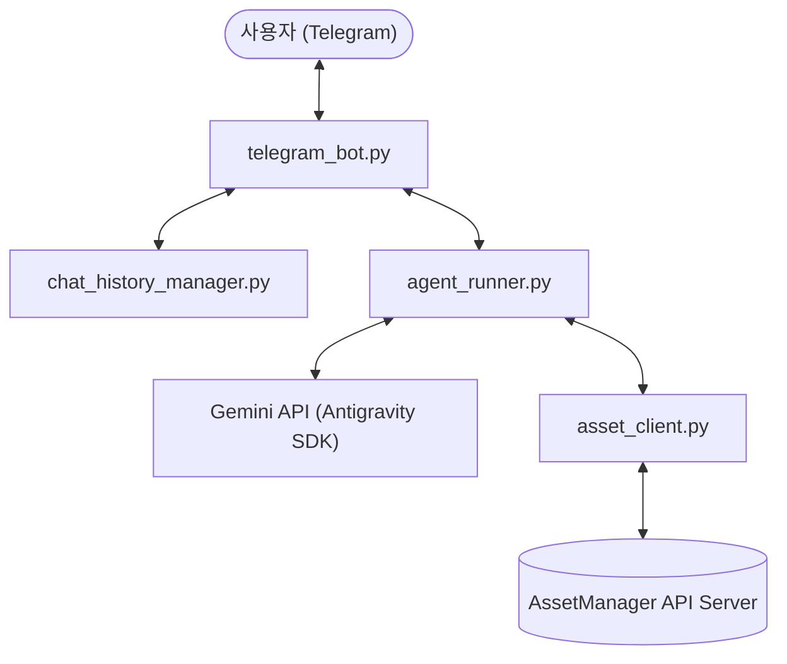

# Asset-jun-bot (통합 자산 관리 도우미 텔레그램 봇)

준과 성은 부부의 통합 자산 정보를 조회하고 분석하는 AI 비서 텔레그램 봇 프로젝트입니다.  
Google DeepMind의 `google-antigravity` SDK를 활용하여 대화형 인터페이스를 지원하며, 실시간 자산 관리 정보(AssetManager API)를 호출하여 답변을 제공합니다.

## 개발 환경 요구사항
- Python 3.12 이상
- [uv](https://github.com/astral-sh/uv) (파이썬 패키지 및 가상환경 관리 도구)

## 설치 및 설정

1. **의존성 설치 및 가상환경 설정**
   ```bash
   uv sync
   ```

2. **환경 변수 설정**
   프로젝트 루트에 `.env` 파일을 생성하고 아래 설정을 입력합니다:
   ```env
   TELEGRAM_BOT_TOKEN="your_telegram_bot_token"
   TELEGRAM_ALLOWED_USER_IDS="allowed_user_id_1,allowed_user_id_2"
   GEMINI_API_KEY="your_gemini_api_key"
   ASSET_MANAGER_API_URL="http://localhost:8000"
   ```

## 실행 방법

### 1. 로컬 개발 패키지 연동
프로젝트를 개발 모드로 설치하여 CLI 명령어로 직접 호출할 수 있도록 합니다.
```bash
uv pip install -e .
```

### 2. 봇 서버 실행 (포그라운드)
아래 명령어를 사용하여 텔레그램 봇 서버를 가동합니다.
```bash
uv run asset-jun-bot
```

### 3. PM2를 활용한 백그라운드 실행
상시 구동 및 자동 재시작이 필요한 서버/운영 환경에서는 PM2를 사용하여 백그라운드 데몬 프로세스로 봇을 실행할 수 있습니다.

#### 전제 조건
* Node.js 및 npm 설치 완료
* PM2 글로벌 설치:
  ```bash
  npm install -g pm2
  ```

#### 구동 방법
```bash
# PM2 실행 (ecosystem.config.js 설정을 사용하여 백그라운드 구동)
pm2 start ecosystem.config.js
```

#### 프로세스 관리 주요 명령어
* **상태 모니터링**: `pm2 status` 또는 `pm2 monit`
* **실시간 로그 모니터링 (애플리케이션 자체 로그)**:
  ```bash
  tail -f <STORAGE_DIR>/logs/bot.log
  ```
  *(참고: 디스크 절약을 위해 PM2 자체의 out/error 로그 파일 쓰기는 비활성화(/dev/null)되어 있으며, 모든 운영 로그는 앱 내 자체 로그 시스템을 통해 지정하신 STORAGE_DIR 내에 기록됩니다.)*
* **서버 중지**: `pm2 stop asset-jun-bot`
* **서버 재시작**: `pm2 restart asset-jun-bot`
* **서버 삭제**: `pm2 delete asset-jun-bot`

### 4. GitHub Actions Self-hosted Runner를 활용한 자동 배포 및 재시작
서버가 외부망에 직접 노출되지 않는 환경(로컬 개발망, 내부 서버 등)에서도 GitHub `master` 브랜치에 코드가 push 되었을 때 자동으로 코드를 최신화하고 서버를 재시작하도록 구축할 수 있습니다.

#### 전제 조건
* 프로젝트 루트에 `.github/workflows/deploy.yml` 파일이 존재해야 합니다.
* 로컬 서버에 GitHub Actions Runner가 설치되어 있어야 합니다.

#### 1) GitHub Actions Runner 등록 및 토큰 발급
1. GitHub 레포지토리의 **Settings** -> **Actions** -> **Runners**로 이동합니다.
2. **New self-hosted runner**를 클릭하고 OS(macOS)와 아키텍처를 선택합니다.
3. 안내되는 스크립트를 서버 터미널에서 차례대로 실행하여 러너 패키지를 설치하고 토큰 설정을 마칩니다.

#### 2) PM2를 사용한 백그라운드 Runner 실행
설치가 끝난 러너 폴더 내에서 터미널을 닫아도 항상 실행되도록 PM2 데몬 프로세스로 러너를 등록합니다.
```bash
# 러너가 설치된 폴더 내에서 실행
pm2 start ./run.sh --name "github-runner"
pm2 save
```
등록이 완료되면 `pm2 status`를 통해 `github-runner` 프로세스가 상시 가동 중임을 확인할 수 있습니다. 이제 `master` 브랜치에 push가 발생할 때마다 로컬 서버가 자동으로 코드를 풀하고 서버를 재기동합니다.

## 테스트 실행

프로젝트 내 구현된 전체 단위 테스트를 구동하려면 아래 명령을 사용합니다.
```bash
uv run python -m pytest
```

---

## 아키텍처 및 소스 코드 탐색 가이드

### 1. 시스템 아키텍처
Asset-jun-bot은 다음과 같은 흐름으로 사용자의 요청을 처리하고 자산 정보를 조회합니다.



---

### 2. 프로젝트 디렉터리 구조
코드 검토가 필요할 때 각 기능이 구현된 파일들의 위치는 다음과 같습니다.

* **[src/asset_jun_bot/](file:///c:/localrepo/Asset-jun-bot/src/asset_jun_bot)**
  * [main.py](file:///c:/localrepo/Asset-jun-bot/src/asset_jun_bot/main.py): 애플리케이션 진입점. 설정을 초기화하고 텔레그램 봇을 구동합니다.
  * [telegram_bot.py](file:///c:/localrepo/Asset-jun-bot/src/asset_jun_bot/telegram_bot.py): 텔레그램 API 연동 및 메시지 송수신 루프를 제어합니다.
  * [agent_runner.py](file:///c:/localrepo/Asset-jun-bot/src/asset_jun_bot/agent_runner.py): Google Antigravity 에이전트를 정의하고, 에이전트가 활용할 도구(Tool) 및 페르소나 지침을 구성합니다.
  * [asset_client.py](file:///c:/localrepo/Asset-jun-bot/src/asset_jun_bot/asset_client.py): `AssetManager API`와 연동하여 실시간 자산 데이터를 가져오는 HTTP 클라이언트입니다.
  * [chat_history_manager.py](file:///c:/localrepo/Asset-jun-bot/src/asset_jun_bot/chat_history_manager.py): 대화 기록을 유저별 파일로 안전하게 관리하며, 60일이 지난 오래된 데이터를 자동 정리합니다.
  * [config.py](file:///c:/localrepo/Asset-jun-bot/src/asset_jun_bot/config.py): 로컬 환경 변수(`.env`) 로드 및 설정 정의 파일입니다.
  * [logging_config.py](file:///c:/localrepo/Asset-jun-bot/src/asset_jun_bot/logging_config.py): 로그 파일 크기 회전(Rotation)을 관리하는 로거 설정입니다.
* **[tests/](file:///c:/localrepo/Asset-jun-bot/tests)**
  * 프로젝트의 TDD 단위 테스트 코드 모음입니다.

---

### 3. 검토 목적별 탐색 경로

| 검토 및 수정하고자 하는 내용 | 찾아가야 할 파일 위치 |
| :--- | :--- |
| **텔레그램 메시지 송수신 로직 및 사용자 차단/인증** | [telegram_bot.py](file:///c:/localrepo/Asset-jun-bot/src/asset_jun_bot/telegram_bot.py) |
| **AI의 대답 스타일 변경 및 시스템 지침(Prompt) 수정** | [agent_runner.py](file:///c:/localrepo/Asset-jun-bot/src/asset_jun_bot/agent_runner.py) |
| **AssetManager API 연동 로직 및 호출 엔드포인트 수정** | [asset_client.py](file:///c:/localrepo/Asset-jun-bot/src/asset_jun_bot/asset_client.py) |
| **대화 히스토리 저장 및 보존 기간(60일) 규칙 변경** | [chat_history_manager.py](file:///c:/localrepo/Asset-jun-bot/src/asset_jun_bot/chat_history_manager.py) |
| **환경 변수 추가 및 기본 설정 항목 수정** | [config.py](file:///c:/localrepo/Asset-jun-bot/src/asset_jun_bot/config.py) |
| **로그 저장 폴더 경로 및 파일 회전 용량 설정 변경** | [logging_config.py](file:///c:/localrepo/Asset-jun-bot/src/asset_jun_bot/logging_config.py) |

